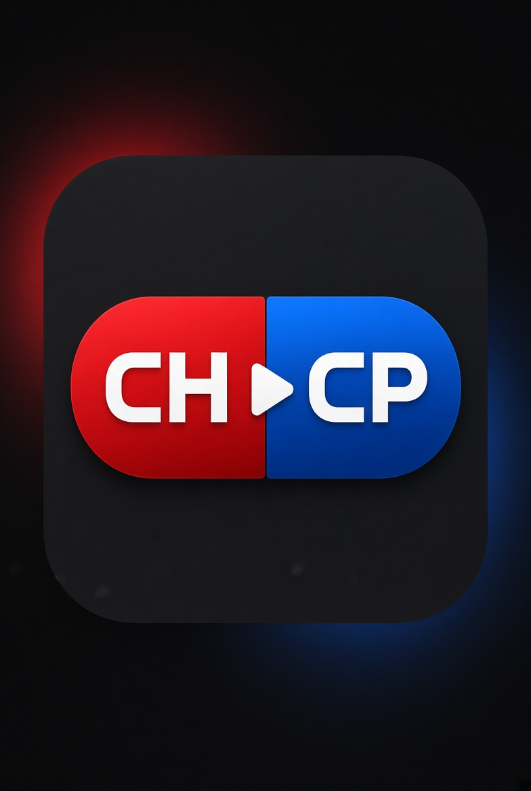

# Cool Pills

  

**Queue videos to [Coolhole](https://coolhole.org) from almost any site.** Cool Pills adds a small CH | CP pill to videos, a waiting list for full queues, and a history/settings panel.

| | |
|---|---|
| **Browser support** | Chrome, Edge, Brave and Firefox |
| **Current release** | [v3.0.22](https://github.com/asoapyoid/coolpills/releases/tag/v3.0.22) |
| **Queue controls** | CH to queue or remove; CP to Work, add to Q+, or schedule |
| **Media recovery** | Coolhost processing for links Coolhole rejects |

## Download

- [Download for Chrome, Edge or Brave](https://github.com/asoapyoid/coolpills/releases/latest/download/cool-pills-chrome-3.0.22.zip)
- [Download for Firefox](https://github.com/asoapyoid/coolpills/releases/latest/download/cool-pills-firefox-3.0.22.zip)
- [View all releases](https://github.com/asoapyoid/coolpills/releases)

## Install

### Chrome, Edge or Brave

1. Download the Chrome ZIP above and extract it.
2. Open `chrome://extensions` and turn on **Developer mode**.
3. Click **Load unpacked** and select the extracted folder containing `manifest.json`.
4. Open [Coolhole](https://coolhole.org) and log in.

### Firefox

1. Download the Firefox ZIP above.
2. Open `about:debugging#/runtime/this-firefox`.
3. Choose **Load Temporary Add-on** and select the downloaded ZIP.
4. Open [Coolhole](https://coolhole.org) and log in.

Firefox's temporary add-on is removed when Firefox closes; load it again after restarting.

## How it works

1. **Find a video.** On supported video sites and pages with HTML5 video, the extension detects videos and shows a CH | CP pill when you hover or point at one. The detector supports YouTube, Vimeo, Twitch, TikTok, Instagram and its mirror domains, X/Twitter, Reddit, Dailymotion, Kick, Facebook, Threads and generic HTML5 videos. Twitch clips use Clipr to look for a direct MP4; Twitch streams keep their existing flow. For social feeds, it can also recognize smaller videos and thumbnails inside marked video posts. If it cannot find a title, the item is labeled "Raw Video".
2. **Send it to Coolhole.** Click **CH** to queue the current video. Cool Pills passes the video link and available metadata (title, duration and thumbnail) to an open Coolhole tab. If there is no Coolhole tab, it opens one with the queue request. If the video is already queued, the control becomes **UN** so you can remove it.
3. **Handle a full queue.** Items that cannot be added yet can wait in **Q+**, the local waiting list. Reorder items by dragging, force or schedule an item, or paste multiple links with **+Link**. With auto-queue enabled, Coolhole adds the next waiting item when a slot opens. A lock prevents multiple Coolhole tabs from sending the same item at once. If Coolhole rejects a media link, Cool Pills sends it to Coolhost for processing and queues the finished MP4; a toast reports the handoff or any failure. Items rejected from Q+ are still removed rather than retried indefinitely.
4. **Choose what CP does.** Click **CP** to focus Coolhole and run Work by default. In settings, change CP to add to Q+ or schedule instead. Hold the pill for quick settings.
5. **Use history and themes.** The Coolhole panel includes searchable **Hist** with pins and one-click re-queue, plus the Q+ list. Choose Default, Old Steam or King Cobra, or match supported Coolhole themes. **Gold Collector** assists with lottery chat lines.

## Coolhost recovery

When Coolhole rejects a link as unplayable, Cool Pills automatically opens or uses a Coolhost tab and submits the selected link for processing. The Coolhole toast explains the handoff. Cool Pills waits for Coolhost to finish and queues the resulting MP4; it does not queue the unfinished source or retry when Coolhole is only at its queue limit. If Coolhost rejects the link, requires a login, or loses the processing connection, Cool Pills reports the problem by toast.

On Coolhost, each active upload with a playable MP4 link gets a **CH** button beside **Copy link**. Click it to send that upload to Coolhole. Expired history entries are not given a button.

## Check for updates

Open the extension's settings and choose **Check for updates**. Cool Pills checks the latest published GitHub release and offers the ZIP for your browser if a newer version is available. The extension cannot silently replace its own files, so download the ZIP, extract it, overwrite the existing extension files, then reload the extension in your browser:

- **Chrome, Edge or Brave:** open the existing Cool Pills folder you selected with **Load unpacked**. Extract the new ZIP and copy its contents into that same folder, choosing **Replace the files in the destination** if Windows asks. Make sure `manifest.json` is still directly inside the selected folder, not inside a newly nested subfolder. Then open `chrome://extensions` (or `edge://extensions` / `brave://extensions`) and click **Reload** on the Cool Pills card. Refresh tabs where you want the updated content scripts to take effect.
- **Firefox:** open `about:debugging#/runtime/this-firefox` and use **Reload** for Cool Pills if that control is available. If it is not, click **Remove**, then **Load Temporary Add-on** and select the new ZIP. Refresh tabs to activate the updated content scripts. Temporary add-ons must be loaded again after Firefox restarts.

## Settings and saved data

Open the extension's settings page from your browser's extensions menu to:

- Enable or disable video detection per site.
- Change the theme, pill opacity, queue limit, auto-queue and CP action.
- Export or import settings and queue data as JSON.

Settings, pending items, history and pins are saved in the browser's local extension storage. Queue data is scoped to the Coolhole account detected in the current tab.

## Keyboard shortcuts

Use **Settings → Keyboard shortcuts** to turn shortcut actions on or off. Firefox also lets you record custom key combinations there. Chrome-based browsers do not let extensions change shortcut assignments programmatically, so use the browser shortcut-settings link in that section to remap them; the switch still controls whether Cool Pills responds to them. The defaults are:

| Shortcut | Action |
| --- | --- |
| `Ctrl+Shift+Q` | Queue the current or hovered video |
| `Ctrl+Shift+W` | Focus Coolhole and run Work |
| `Ctrl+Shift+H` | Toggle the Hist / Q+ panel |

Browsers may reserve a shortcut. Remap it in the browser's extension shortcut settings.

## Troubleshooting

- **No CH | CP pill appears:** confirm the site is enabled in Cool Pills settings, refresh the page after installing/updating, and hover or point at the video.
- **Coolhole does not accept a link:** the extension will try Coolhost recovery for an actual media rejection. Some sites require a public, directly fetchable link; Coolhost may be unable to access private posts, expiring links, or media behind a login.
- **The upload finished but is not in Coolhole:** confirm you are logged in to Coolhole and check the toast for a queue error. You can also return to the active Coolhost upload and click its **CH** button.
- **Q+ does not advance:** keep a Coolhole tab open, sign in, enable Q+ auto-queue, and make sure the room has an available queue slot.

## Permissions and privacy

Cool Pills runs on pages where it looks for videos, so the browser asks to allow access to sites you visit. It uses browser storage for your settings and queue-related data, and communicates with Coolhole to carry out queue and Work actions. When you choose to queue or schedule, the selected video link and its available metadata are sent to Coolhole. The extension may fetch public page metadata such as a title, duration or thumbnail so queued items are recognizable.

When queuing a social post without an exposed media file, Cool Pills tries a site-specific public resolver: X uses VxTwitter then FxTwitter; Reddit checks RapidSave only for a direct MP4 file; TikTok tries TikWM then MusicalDown; Facebook tries FBDown; Instagram tries the ddinstagram mirror; Twitch clips try Clipr. A Reddit `download.php` endpoint is a download action, not a playable media URL, so Cool Pills will not queue it. Reddit video-only streams are also not used for regular videos because that can remove the audio. Resolver results are accepted only from the expected media hosts (for example Twitch's `clips-media-assets.twitch.tv` or TikTok's video CDN), and no source-site login cookies are sent. These services receive the public post URL when you click to queue it. If a lookup fails, Cool Pills continues with the original post URL rather than stopping, so Coolhole can try it and Coolhost recovery can run if Coolhole rejects it. On other sites, when the hovered HTML5 player exposes a direct MP4/WebM URL, Cool Pills queues that media file rather than the surrounding page. Private, region-restricted, expired, or login-gated media may still fail both a resolver and Coolhost.

If Coolhole rejects a selected link as unplayable, Cool Pills automatically sends that link and its title to Coolhost (`coolhost.ca`) for processing. The browser uses your Coolhost session for this request if you are signed in; the original site's cookies are not sent by Cool Pills. Coolhost receives the submitted URL and may need to fetch the media from its source. The finished Coolhost MP4 is then sent to Coolhole; it is not queued before processing completes. This does not happen when Coolhole is merely at its queue limit or when the link is already hosted on Coolhost. A **CH** button beside each active Coolhost upload link also lets you queue it manually; expired uploads are not given a button.

## License

MIT. See [LICENSE](LICENSE).
